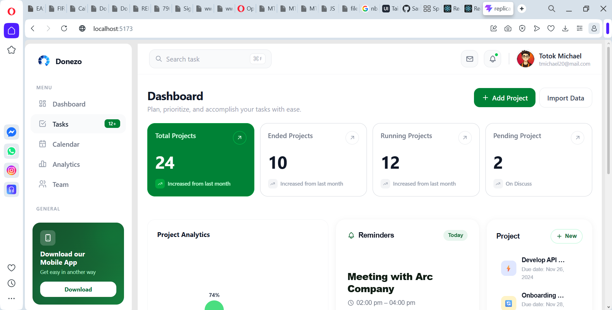

# 📊 Dashboard

A React-based dashboard interface built with Vite, featuring a clean data-focused layout for tracking metrics and activity. Styled with Tailwind CSS and structured with reusable, component-driven UI.



## ✨ Features

- Dashboard overview layout with key stats and activity sections
- Clean, component-based structure
- Client-side routing with React Router
- Icon system powered by Tabler Icons
- Utility-first styling with Tailwind CSS v4
- Fast dev/build tooling via Vite

## 🧭 Project Status

This project is under active development. **The current build is optimized for desktop viewing and is not yet responsive across tablet and mobile breakpoints** — mobile-first responsive support is planned as an upcoming improvement.

## 🛠 Tech Stack

- **React 19** — UI library
- **Vite** — build tool and dev server
- **Tailwind CSS v4** — utility-first styling
- **React Router** — client-side routing
- **Tabler Icons (React)** — icon set
- **ESLint** — code linting

## 🚀 Live Demo

[View Live Site](https://db-nine-silk.vercel.app/)

## 📦 Getting Started

### Prerequisites

Make sure you have [Node.js](https://nodejs.org/) and npm installed.

```bash
node -v
npm -v
```

### Installation

1. Clone the repository
   ```bash
   git clone https://github.com/SamuelIboi/DashBoard.git
   ```
2. Navigate into the project folder
   ```bash
   cd DashBoard
   ```
3. Install dependencies
   ```bash
   npm install
   ```
4. Start the development server
   ```bash
   npm run dev
   ```
5. Open [http://localhost:5173](http://localhost:5173) to view it in your browser.

## 📜 Available Scripts

| Command           | Description                                      |
|-------------------|---------------------------------------------------|
| `npm run dev`     | Runs the app in development mode with hot reload  |
| `npm run build`   | Builds the app for production to the `dist` folder |
| `npm run preview` | Locally previews the production build             |
| `npm run lint`    | Runs ESLint across the project                    |

## 📁 Project Structure

```
DashBoard/
├── public/          # Static assets
├── src/             # React components, routes, and app logic
├── index.html       # Vite entry HTML
├── vite.config.js   # Vite configuration
├── package.json     # Project metadata and dependencies
└── README.md
```

## 🤝 Contributing

Contributions, issues, and feature requests are welcome.

1. Fork the project
2. Create your feature branch (`git checkout -b feature/AmazingFeature`)
3. Commit your changes (`git commit -m 'Add some AmazingFeature'`)
4. Push to the branch (`git push origin feature/AmazingFeature`)
5. Open a Pull Request

## 📄 License

This project is open source and available under the [MIT License](LICENSE).

## 👤 Author

**Samuel Iboi**
GitHub: [@SamuelIboi](https://github.com/SamuelIboi)
Email: [kevwesamii@gmail.com](mailto:kevwesamii@gmail.com)

---

⭐️ If you like this project, consider giving it a star on GitHub!
